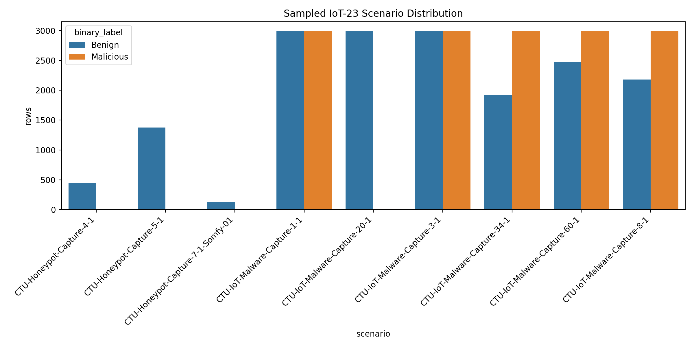
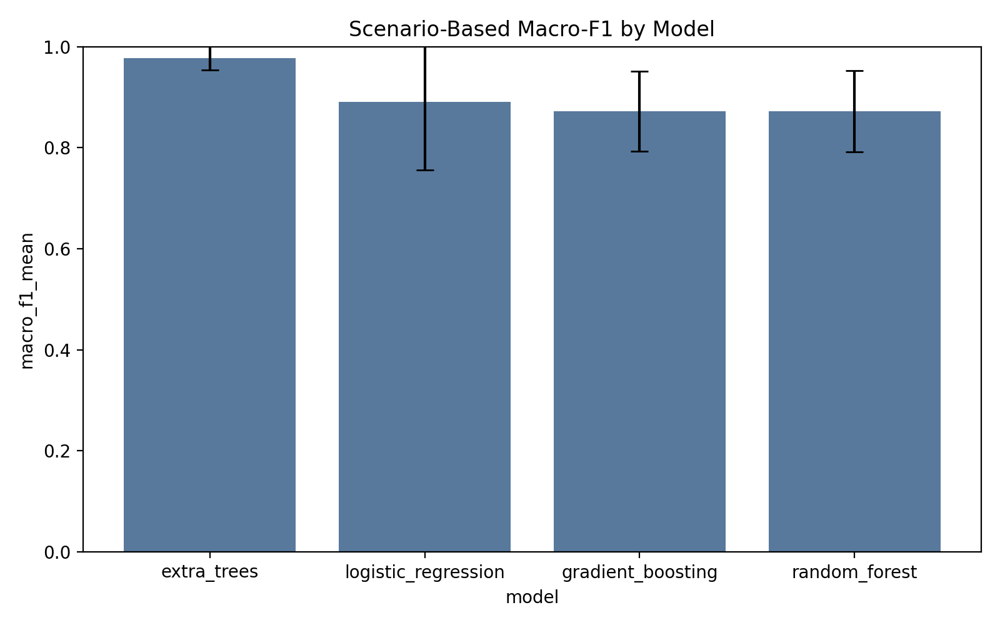

# IoT Intrusion Detection on IoT-23

This repository contains a Phase 2 IoT intrusion-detection pipeline built on the IoT-23 dataset. The project started with a simple baseline experiment and was then upgraded to a more reliable scenario-based benchmark designed to reduce leakage and produce paper-quality results.

## Overview

The project focuses on three goals:

- build interpretable machine-learning baselines for malicious vs benign IoT traffic
- analyze whether suspicious traffic forms meaningful groups under unsupervised methods
- move from optimistic random row splits to scenario-based evaluation on unseen captures

The current repository includes:

- a baseline IoT-23 pipeline with feature extraction, classification, clustering, and feature reduction
- a stronger scenario-based evaluation pipeline with leakage controls and more reliable metrics
- generated result tables, figures, and summaries for reporting

## Datasets

The main benchmark uses official IoT-23 scenario files from Stratosphere IPS:

- benign scenarios: Philips HUE, Amazon Echo, Somfy Doorlock
- malicious families: Hide-and-Seek, Muhstik, Hakai, Torii, Mirai, Gagfyt

Official source:

- [IoT-23 dataset page](https://www.stratosphereips.org/datasets-iot23)
- [IoT-23 Zenodo record](https://zenodo.org/records/4743746)

Raw dataset files are intentionally **not tracked in Git** because several scenario files exceed normal GitHub size limits. The repository is configured to keep code, documentation, and report artifacts under version control while leaving raw data local.

## Methodology

### Feature extraction

The pipelines extract flow-level and lightweight derived features from Zeek `conn.log.labeled` files, including:

- source and destination ports
- protocol type
- flow duration
- packet counts and byte counts
- IP-byte counts
- connection state and traffic history
- derived ratios such as byte ratio, packet ratio, total bytes, and bytes per second

### Models

The project includes two experiment tracks.

Baseline track:

- Logistic Regression
- Random Forest
- Gradient Boosting
- clustering with K-means, Agglomerative Clustering, and DBSCAN

Reliable track:

- Logistic Regression
- Random Forest
- Gradient Boosting
- Extra Trees

### Reliable evaluation design

The reliable benchmark was created to address the main weakness of the original pilot run.

- 9 official IoT-23 scenarios were used
- 5 scenario-based holdout splits were created
- each split tested on unseen scenarios, not random rows from the same capture
- label and metadata columns were excluded from the model features
- per-scenario sampling was used to reduce class imbalance
- stronger metrics were reported: macro-F1, balanced accuracy, PR-AUC, MCC, and false positive rate

## Reliable Results

The current best result comes from the scenario-based benchmark in `outputs/reliable_iot23_phase2`.

Dataset summary:

- 9 scenarios
- 32,552 sampled rows after balancing-by-scenario
- 17,536 benign rows
- 15,016 malicious rows

Performance across 5 unseen-scenario splits:

| Model | Macro-F1 | Balanced Accuracy | PR-AUC | MCC | False Positive Rate |
|---|---:|---:|---:|---:|---:|
| Extra Trees | 0.9776 ± 0.0238 | 0.9780 ± 0.0238 | 0.9531 ± 0.0449 | 0.9555 ± 0.0476 | 0.0298 ± 0.0289 |
| Logistic Regression | 0.8901 ± 0.1341 | 0.8935 ± 0.1317 | 0.9136 ± 0.0850 | 0.7915 ± 0.2612 | 0.1318 ± 0.1351 |
| Gradient Boosting | 0.8722 ± 0.0797 | 0.8729 ± 0.0800 | 0.7889 ± 0.1435 | 0.7780 ± 0.1292 | 0.2409 ± 0.1732 |
| Random Forest | 0.8720 ± 0.0807 | 0.8725 ± 0.0817 | 0.9564 ± 0.0396 | 0.7776 ± 0.1305 | 0.2404 ± 0.1772 |

Interpretation:

- the earlier `99%+` random-split result was optimistic
- the scenario-based benchmark is harder and much more trustworthy
- Extra Trees is the strongest and most stable current baseline
- the current result is strong enough for a serious project report and a credible paper foundation

## Figures

Reliable benchmark artifacts:

- [metrics summary](outputs/reliable_iot23_phase2/metrics_summary.csv)
- [split-level metrics](outputs/reliable_iot23_phase2/split_metrics.csv)
- [leakage report](outputs/reliable_iot23_phase2/leakage_report.json)
- [scenario inventory](outputs/reliable_iot23_phase2/scenario_inventory.csv)
- [class distribution figure](outputs/reliable_iot23_phase2/scenario_class_distribution.png)
- [model macro-F1 summary figure](outputs/reliable_iot23_phase2/model_macro_f1_summary.png)
- [feature importance](outputs/reliable_iot23_phase2/feature_importance.csv)

Example result figures:





## Repository Structure

```text
IOT-project-root/
├── README.md
├── requirements.txt
├── src/
│   ├── phase2_iot23.py
│   └── phase2_iot23_reliable.py
├── data/
│   ├── iot23/
│   └── iot23_multi/
├── outputs/
│   ├── real_iot23_phase2/
│   ├── real_iot23_phase2_multi_cluster/
│   └── reliable_iot23_phase2/
└── .gitignore
```

## Installation

```bash
python3 -m venv .venv
source .venv/bin/activate
pip install -r requirements.txt
```

## Reproducing The Experiments

### 1. Baseline pipeline

```bash
python3 src/phase2_iot23.py \
  --data /path/to/conn.log.labeled \
  --output-dir outputs/real_iot23_phase2_multi_cluster \
  --sample-size 50000
```

### 2. Reliable scenario-based benchmark

Place the official IoT-23 `conn.log.labeled` scenario files under `data/iot23_multi/raw/`, then run:

```bash
PYTHONPATH=src python3 src/phase2_iot23_reliable.py \
  --data-dir data/iot23_multi/raw \
  --output-dir outputs/reliable_iot23_phase2 \
  --max-per-class-per-scenario 3000 \
  --num-splits 5
```

## Key Output Files

For the strongest current experiment, use the files in `outputs/reliable_iot23_phase2/`.

- `metrics_summary.csv`: averaged results across all scenario-based splits
- `split_metrics.csv`: per-split model performance
- `leakage_report.json`: leakage-control checks
- `scenario_inventory.csv`: scenario and class composition
- `feature_importance.csv`: most informative features from the best model
- `reliable_summary.txt`: short report-ready experiment summary

## Limitations

This project is much stronger than the initial pilot run, but it still has important limits:

- benign diversity is smaller than malicious diversity in IoT-23
- some malicious scenarios contain mixed benign and malicious flows
- validation is still within IoT-23; external validation on another dataset is still needed

## Next Steps

Recommended next phase:

- validate on a second benchmark such as CICIoT2023 or N-BaIoT
- add explainability or analyst-facing reporting
- add an LLM-based explanation layer on top of the detection pipeline
- compare scenario-based baselines against anomaly-detection methods

## Citation

If you use IoT-23, please cite the official dataset record from Stratosphere IPS and Zenodo.
